Bakhtar Journal of Engineering and Technology
Volume 1/Issue 2/ Oct-Nov-Dec 2025
Research Article

# Emotion Recognition from Text Using RoBERTa: A Deep Learning Approach for Enhanced Emotion Recognition

Irfanullah Safi $^{1}$ , Fida Mohammad Safi $^{2}$ , Mohammad Shah Omid $^{3}$ $^{1,2,3}$ Computer Science Department, Bakhtar University, 1001-Kabul, Kabul, Afghanistan

Corresponding Author Email Id: Irfanullah.ihsan@gmail.com $^{1}$

## Abstract

Emotion Recognition in Conversations (ERC) has emerged as a crucial area in the development of emotionally intelligent systems. Recently, graph-based network (GBN) models have attracted significant interest for their ability to comprehend conversational contexts. However, these models frequently struggle to effectively capture and utilize contextual information in conversations, which hinders their overall effectiveness. To address these challenges, this study proposes a novel computational framework named AMRoBERTa (Augmentation Model A Robustly Optimized BERT Pretraining Approach). The model focuses on identifying human emotions by employing a balanced version of the Multimodal Emotion Lines Dataset (MELD). The approach leverages augmentation techniques to create multiple enriched datasets from MELD, which are subsequently used to train a deep neural network (DNN) integrated with transformer-based encoders. For text representation, the model utilizes RoBERTa (A Robustly Optimized Bidirectional Encoder Representations from Transformers), which ensures contextually rich word embeddings. By addressing the issue of data imbalance through dataset balancing, the proposed model enhances its capability to generalize across various scenarios. Comprehensive experimental evaluations on the MELD dataset reveal the model's superior performance, achieving a remarkable weighted F1-score of 66.20% and an accuracy of 66.20%, thereby outperforming existing methods in the field.

Keywords: MELD, RoBERTa, DNN, AMRoBERTa, GBN.

## 1. Introduction

Emotion recognition in conversation (ERC) is a distinct area within the broader field of emotion recognition (ER). It specifically aims to detect the emotions expressed by individuals during their interactions with one another. Emotions, being a fundamental aspect of human nature, play a vital role in advancing humanoid Artificial Intelligence (AI). Emotion recognition in conversation (ERC) has attracted significant research interest due to its capability to analyze and extract sentiments and opinions from publicly available conversational data across various platforms. These platforms include LinkedIn, Twitter, Reddit, YouTube, Facebook, E-commerce websites.

In this study, the Multimodal Emotion Lines Dataset (MELD) [1] is employed to train the proposed model. While MELD offers multimodal data, this research focuses exclusively on its textual component for model development.

The dataset comprises 1,400 conversations and 13,000 utterances, with each utterance categorized into one of seven emotional classifications: fear, surprise, joy, sadness, neutral, disgust, or anger.

Textual expressions often go beyond the direct use of emotion-related words, encompassing the interpretation of concepts and their interactions as described within a text. Determining an individual's emotional state by analyzing their written content is both a challenging and necessary task. In human-computer interaction, identifying the emotional nuances in text plays a vital role [2].

This study centers on detecting emotions in conversations utilizing the Multimodal Emotion Lines Dataset (MELD). The MELD dataset is organized into three distinct subsets: training, testing, and validation. However, these subsets contain varying sample sizes across different emotion classes, making the dataset inherently unbalanced. To address this, various text augmentation techniques were applied alongside down-sampling to create balanced datasets, ensuring uniform emotion class distribution while maintaining distinct training, testing, and validation samples.

Machine learning and deep learning models cannot directly process raw text data. Consequently, it is necessary to convert the text into a numerical representation before analysis. To achieve this, we employed the transformer-based RoBERTa base case pre-trained model, which is well-suited for generating context-aware representations. This model converts text into input IDs and attention mask vectors for each utterance, ensuring a robust numerical encoding. These vectors are then utilized as input for training a deep neural network (DNN).

## 2. Literature Review

This section reviews key models and methodologies addressing emotion recognition in conversations. Choi et al. [4] presented a residual-based graph convolutional network (RGCN) that uses ResNet for intra-utterance features and GCN for inter-utterance relations. With a novel loss function and GloVe embeddings, RGCN outperformed models like bc-LSTM and DialogueRNN, achieving a $55.98\%$ F1 score on MELD. Ghosal et al. [5] proposed DialogueGCN, which applied GloVe embeddings and grid search optimization, reaching a $58.10\%$ F1 score and $59.46\%$ accuracy. Majumder et al. [6] introduced DialogueRNN, combining CNN and RNN with emotion-labeled utterances, achieving $57.03\%$ F1 and $59.54\%$ accuracy. Hu et al. [7] developed DialogueCRN, which models context and emotional evolution across dialogue turns, yielding a $58.39\%$ F1 and $60.73\%$ accuracy. Zhong et al. [8] introduced KET, incorporating commonsense knowledge via ConceptNet [10] and an emotion lexicon [9], resulting in a $58.18\%$ F1 score.

Xing et al. [11] proposed the Adapted Dynamics Memory Network (A-DMN), a multimodal model using textual, audio, and visual features, achieving a 60.45% F1 score. Wang et al. [12] used an LSTM-based encoder with CNN and GloVe inputs, reporting a 58.36% F1 score. Yeh et al. [13] introduced dialogical emotion decoding (DED), which combines CNN, RNN, and ddCRP, attaining 43.6% accuracy on MELD and 69.0% on IEMOCAP. Jiao et al. [14] proposed the Attention Gated Hierarchical Memory Network (AGHMN), a dual-level model using word2Vec, yielding 63.5% F1 on IEMOCAP and 58.1% on MELD.

Li et al. [15] enhanced utterance representation via speaker identification and BERT, supported by a Bi-GRNN classifier, achieving up to 61.90% F1. Zhang et al. [16] developed ConGCN, reformulating emotion recognition as graph node classification, scoring 59.4% F1 on multimodal MELD. Sheng et al. [17] presented SumAggGIN, merging local and global inference through CNNs and Bi-LSTM, achieving a 58.45% F1 score. Lu et al. [18] proposed an iterative interaction network using a bi-GRU, attaining 60.72% F1. Li et al. [19] introduced a bidirectional emotion recurrent unit using CNN and Max-Pooling, reaching 60.9% accuracy. Ishiwatari et al. [20] applied relational position encodings in RGAT, leveraging BERT and attention to reach a 60.91% F1. Lastly, Hu et al. [21] proposed the multimodal dynamic fusion network (MM-DFN), using Bi-GRU for text and multimodal fusion, achieving 62.49% accuracy and 59.46% F1.

## 3. Methodology

The proposed model architecture, illustrated in Figure 3.1, outlines the overall approach. The study begins with a comprehensive review of existing emotion classification models for conversational text, highlighting their advancements and limitations—particularly in accuracy and generalization. This review identifies key gaps, forming the basis for the new model. The MELD (Multimodal EmotionLines Dataset) is selected for evaluation, focusing exclusively on its textual modality. MELD presents a challenge due to class imbalance, which is addressed through various text augmentation techniques to improve the model's generalization on underrepresented emotions. To convert raw text into context-aware numerical vectors, RoBERTa, a transformer-based embedding model, is employed.

Chosen for its superior performance in capturing nuanced contextual relationships, RoBERTa enhances the model's understanding of emotional cues in dialogue.

Following embedding, the emotion classification model is trained using RoBERTa outputs. Multiple classifiers are tested—including fully connected neural networks, support vector machines, and attention-based models—to identify the most effective architecture. Model performance is evaluated using accuracy, precision, recall, F1 score, and a confusion matrix. These metrics provide insight into classification strengths and weaknesses, particularly under class imbalance, and assess the model's practical applicability.

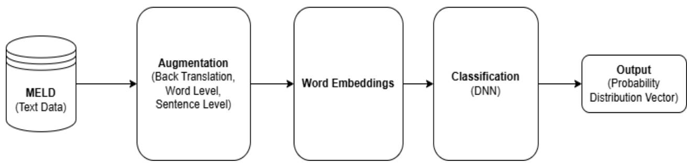  
Figure 3.1: Architecture Diagram of Proposed Model

## 3.1 Dataset

This study employs the MELD dataset $[1]$ as a benchmark, an extended version of the EmotionLines dataset $[22]$ . MELD is a multimodal corpus containing text, video, and audio data from the television series Friends. For the purposes of this research, only the textual data is utilized. The dataset consists of approximately 1,400 conversations and 13,000 utterances, each annotated with one of seven emotion labels: fear, surprise, joy, sadness, neutral, disgust, and anger.

## 3.2 Text Data Augmentation

A significant challenge in classification tasks is class imbalance, which can bias models toward majority classes $[23]$ . The MELD dataset exemplifies this issue, with the neutral class containing 4,710 instances, while the disgust class includes only 271, as illustrated in Figure 3.2. Addressing such imbalance is critical to prevent biased predictions. Various data augmentation and resampling techniques have been developed to mitigate this problem $[24]$ , which this research explores to improve model performance across all emotion classes.

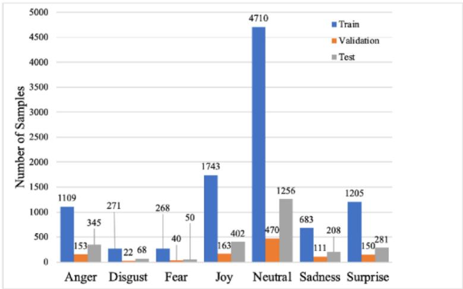  
Figure 3.2: MELD class Distribution

To mitigate the class imbalance, present in the MELD dataset, this study applies synonym replacement as a data augmentation technique. Words within minority class sentences are substituted with contextually appropriate synonyms to preserve semantic meaning while increasing linguistic diversity. The replacements are generated using the RoBERTa-based (roberta-base) pre-trained contextual word embedding model, ensuring that the augmented sentences remain contextually coherent and suitable for model training.

## 3.3 Transformers

Transformer architecture, introduced by Vaswani et al. [41], revolutionized natural language processing by enabling parallel processing of entire input sequences through self-attention mechanisms. Unlike traditional models such as RNNs and CNNs, which process text sequentially, the Transformer allows simultaneous processing, improving efficiency and scalability for large datasets.

In this research, RoBERTa (A Robustly Optimized BERT Pretraining Approach) is used as the primary model for feature extraction. RoBERTa builds Transformer encoder architecture and enhances BERT by training on more data with longer sequences, dynamic masking, and without the next sentence prediction objective. These improvements enable RoBERTa to produce deep contextual embeddings that effectively capture semantic and syntactic relationships in text. RoBERTa's strength lies in its ability to model each word in relation to its full context using multi-head self-attention, which is essential for emotion recognition in conversations. In this study, RoBERTa is applied to the MELD dataset to convert input text into contextualized embeddings, which are then used for emotion classification. Its superior contextual understanding makes it well-suited for handling the nuanced expressions found in real-world dialogue.

## 3.4 Word Embedding

Word embedding transforms textual data into numerical vectors, enabling machines to process language effectively. Traditional non-contextual embeddings like Word2Vec and GloVe assign static vectors to words regardless of context, limiting their ability to capture nuanced meanings. To overcome these limitations, contextual word embeddings generated by transformer-based models have become the state-of-the-art. These embeddings dynamically represent words based on their surrounding context, significantly improving performance in natural language processing tasks.

In this study, we employ RoBERTa, a robustly optimized variant of BERT, which enhances the pretraining process by utilizing more data and advanced training strategies. RoBERTa constructs input representations using token, position, and segment embeddings, processed through multiple transformer encoder layers to produce high-quality contextual embeddings. The use of RoBERTa allows for effective fine-tuning on specific tasks such as emotion classification and named entity recognition, enabling the model to capture complex semantic and syntactic relationships in the text. This approach ensures superior performance compared to traditional embedding methods, particularly for languages with rich morphology and diverse syntax.

## 3.5 Deep Neural Network

In this study, a Deep Neural Network (DNN) is employed as the core classification model for emotion recognition in conversational data. DNNs, a key branch of artificial intelligence, learn hierarchical feature representations directly from input data, which makes them highly effective across diverse fields including speech recognition $[37]$ – $[40]$ , image processing $[41]$ – $[45]$ , natural language processing $[46]$ – $[50]$ , and bioengineering $[51]$ – $[55]$ . Numerous studies confirm that deep learning models outperform traditional machine learning techniques on complex tasks $[56]$ , $[57]$ , motivating the use of a DNN for emotion classification.

The architecture of the DNN in this work consists of two input layers—processing input IDs and attention masks derived from word embeddings—followed by two hidden layers and a final output layer, as illustrated in Figure 3.5. The first hidden layer contains 512 neurons with a ReLU activation function, facilitating non-linear feature extraction. The output layer uses a SoftMax activation function over 7 neurons to predict the probability distribution of emotion classes, with the highest probability indicating the predicted label. To optimize training, the Adam optimizer is utilized for weight adjustment, balancing computational efficiency and convergence stability. While deeper networks typically yield better performance [48], challenges such as overfitting and increased complexity are carefully managed through architectural and training choices [58]–[60].

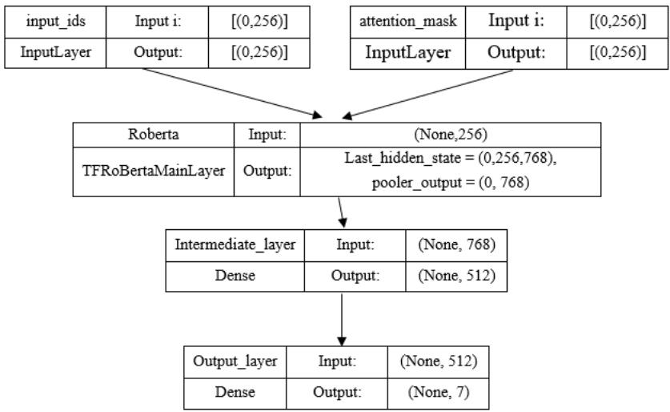  
Figure 3.3: Deep Neural Network structure for emotions classification

## 3.6 Performance Evaluation

To ensure the reliability and applicability of the proposed classification model, a comprehensive performance evaluation was conducted using several well-established metrics. These metrics provide quantitative insights into the model's ability to correctly classify emotions from conversational text.

The following evaluation metrics were utilized:

\- Confusion Matrix (multi-class): A $7 \times 7$ matrix, corresponding to the seven emotion classes in the MELD dataset, was used to analyze classification results.

• Accuracy (ACC): Measures the proportion of correctly classified instances.

\- Precision: Assesses the accuracy of positive predictions.

\- Recall (Sensitivity): Indicates the model's ability to identify all relevant instances of a class.

\- Specificity: Evaluates the ability of the model to identify negative cases correctly.

• F1 Score: Provides a harmonic mean of precision and recall, particularly useful for imbalanced datasets.

Each metric is computed based on four fundamental values derived from the confusion matrix: True Positives (TP), False Positives (FP), True Negatives (TN), and False Negatives (FN). The study also presents mathematical formulations for each metric to ensure clarity and reproducibility.

The confusion matrix is particularly emphasized, detailing how TP, FP, TN, and FN are calculated in a multi-class setting. It allows further derivation of other performance indicators, such as:

$$
\bullet \quad \text { Specificity: } s p = \frac {\text { no   of   true   negative }}{\text { no   of   true   negative } + \text { no   of   false   positive }} = \frac {T N}{T N + F P}
$$

$$
\bullet \quad \text { Sensitivity   (Recall): } s n = \frac {\text { no   of   true   positive }}{\text { no   of   true   positive } + \text { no   of   false   negative }} = \frac {T P}{T P + F N}
$$

$$
\text { Accuracy:   Accuracy } = \frac {\text { no   of   correct   prediction }}{\text { total   number   of   predictions }} = \frac {T P + T N}{T P + T N + F P + F N}
$$

$$
\text { Precision:   precision } = \frac {\text { True   Positive }}{\text { Total   predicted   positive }} = \frac {T P}{T P + F P}
$$

$$
\text { F1   Score: } f 1 - s c o r e = 2 \times \frac {(p r e c i s i o n * r e c a l l)}{(p r e c i s i o n + r e c a l l)}
$$

## 4. Results and discussion

In this section, we present and analyze the experimental results obtained using different sizes of the benchmark dataset.

## 4.1 Experiment-1

In the initial phase of experimentation, the original MELD dataset was utilized to train and validate the proposed model. This dataset comprised 9,989 samples for training, 1,109 for validation (referred to as MELDV), and 2,610 for testing (denoted as MELDT). To convert the textual utterances into numerical feature representations, the RoBERTa model was applied. The training and validation loss trends are illustrated in Figure 4.1, while the corresponding accuracy results are shown in Figure 4.2.

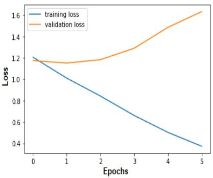  
Figure 4.1: Error Loss of Proposed Model on both Training and Validation Dataset in Experiment-1

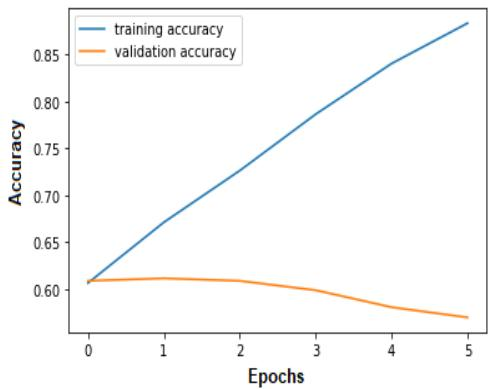  
Figure 4.2: Accuracy of Proposed Model on both Training and Validation Dataset in Experiment-1

Figure 4.2 demonstrates that the training accuracy of the proposed model improves significantly from 61.65% to 89.33% as the number of epochs increases. Conversely, the validation accuracy decreases from 61.88% to 57.98%, suggesting that the model is overfitting. This means it learns the training data well but fails to generalize effectively to new, unseen data. The ReLU activation function was utilized in the hidden layers, while the SoftMax function was applied in the output layer to support multi-class classification.

## 4.2 Experiment-2

This experiment evaluates the effectiveness of the proposed model using the augmented MELD dataset, with a particular focus on the neutral emotion class. The dataset contains 4,710 instances labeled as neutral, significantly outnumbering the instances in other emotion categories. To address this class imbalance, data augmentation techniques were applied to the underrepresented classes. The outcomes of this experiment are depicted in Figures 4.3 and 4.4.

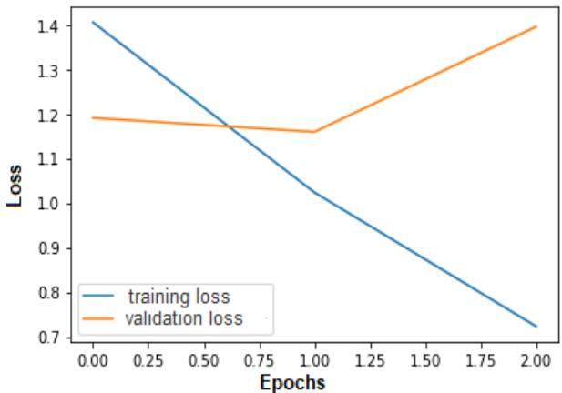  
Figure 4.3: Proposed Model on both Training and Validation Dataset in Experiment-2

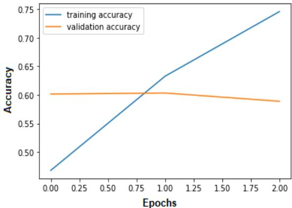  
Figure 4.4: Accuracy of Proposed Model on both Training and Validation Dataset in Experiment-2

As shown in Figure 4.3, the training error loss steadily decreases with each epoch, reflecting better performance on the training set. However, the validation error loss exhibits an upward trend, implying that the model may be overfitting and failing to generalize effectively to new data. According to Figure 4.4, training accuracy increases from 53.30% to 84.22%, while validation accuracy declines from 58.45% to 55.38%, further supporting the presence of overfitting.

## 4.3 Experiment-3

In the third experimental setup, the model is trained using the augmented MELDJ1743 training dataset, while evaluation is conducted on the MELDT test set (2,610 instances) and MELDV validation set (1,109 instances). To ensure variation, the training data is shuffled with 2,000 samples and the validation data with 100 samples. The model receives input in the form of tokenized input IDs and corresponding attention masks. The training configuration includes a learning rate of 1e-5, weight decay of 1e-6, a batch size of 16, the Categorical Cross-Entropy as the loss function, and the Adam optimizer. Training is performed over 3 epochs. The results of the experiment are shown in Figure 4.5, where the training and validation loss are illustrated, and in Figure 4.6, which depicts the accuracy of the model. These figures help assess the model's performance in terms of loss and accuracy on both training and validation datasets.

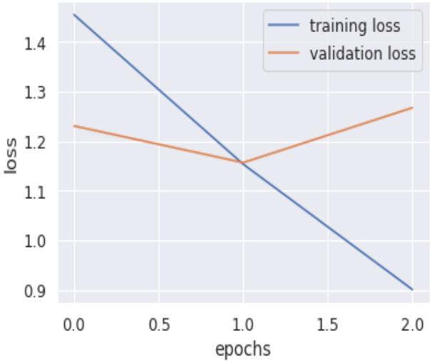  
Figure 4.5: Error Loss of Proposed Model on both Training and Validation Dataset in Experiment-3

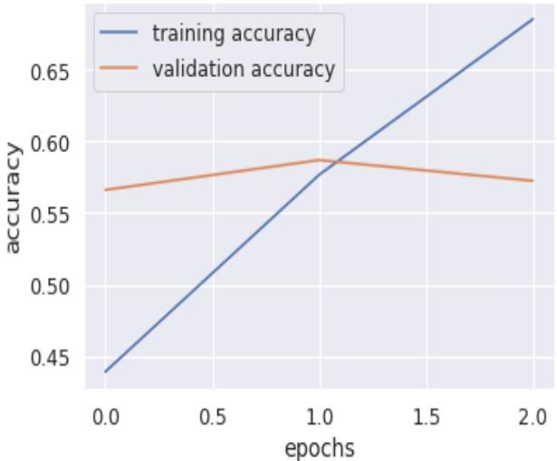  
Figure 4.6: Accuracy of Proposed Model on both Training and Validation Dataset in Experiment-3

In the third experimental phase, the observed results in terms of training and validation accuracy reveal a distinct pattern. Training accuracy steadily increases over the course of three epochs, progressing from 44.92% to 69.55%. Conversely, validation accuracy exhibits a slight downward trend, falling from 59.71% to 58.26%. A similar trend is evident in the loss metrics: the training loss decreases, suggesting enhanced performance on the training set, while the validation loss shows a marginal rise. This divergence between training and validation performance implies the onset of overfitting, where the model becomes increasingly tailored to the training data, thereby compromising its ability to generalize effectively to new, unseen inputs.

## 4.4 Experiment-4

In the fourth experimental setup, the model is trained using the augmented MELDA1109 dataset, alongside the MELDT dataset (2,610 instances) for testing and the MELDV dataset (1,109 instances) for validation. All hyperparameters and configurations remain consistent with those used in the third experiment. Figures 4.7 and 4.8 illustrate the model's performance in terms of training and validation loss, as well as accuracy, respectively. This setup enables a direct comparison, allowing for an evaluation of how the changes in the training dataset affect model behavior across both training and validation phases. The resulting patterns provide valuable insight into the impact of dataset augmentation on model performance.

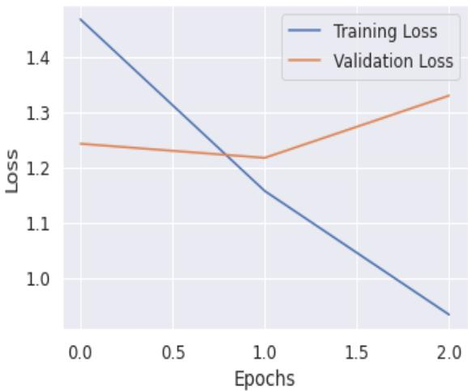  
Figure 4.7: Error Loss of Proposed Model on both Training and Validation Dataset in Experiment-4

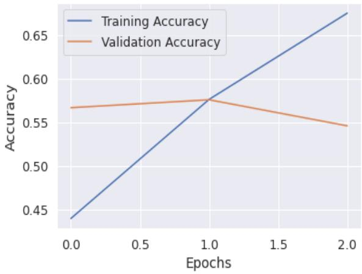  
Figure 4.8: Accuracy of Proposed Model on both Training and Validation Dataset in Experiment-4

In the fourth experiment, the training accuracy increases with each epoch, rising from 43.99% to 68.56% over 3 epochs. However, the validation accuracy decreases from 57.71% to 55.63%, as shown in the accuracy figure.

## 4.5 Experiment-5

In the fifth experiment, the model is trained using the enhanced MELDAvg1427 dataset for training, while the MELDT (2,610 samples) and MELDV (1,109 samples) datasets are used for testing and validation, respectively. The experimental settings, including hyperparameters, remain unchanged from the third experiment. Figures 4.9 and 4.10 depict the loss and accuracy values for both training and validation phases. This configuration facilitates an in-depth evaluation of how the newly introduced training data influences model learning and generalization. By analyzing these performance trends, we can better understand the model's ability to adapt to the modified dataset and maintain accuracy across different stages.

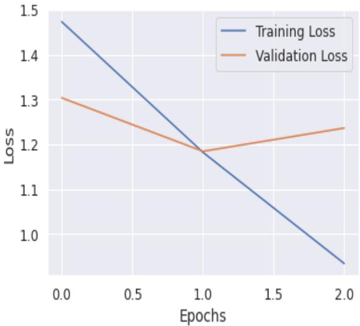  
Figure 4.9: Error Loss of Proposed Model on both Training and Validation Dataset in Experiment-5

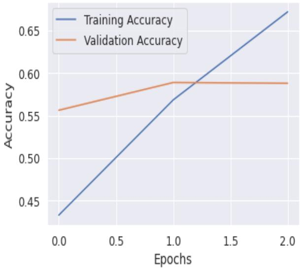  
Figure 4.10: Accuracy of Proposed Model on both Training and Validation Dataset in Experiment-5

In the fifth experiment, the model's training accuracy steadily improves, rising from 44.29% to 68.20% across three epochs. In contrast, the validation accuracy shows a slight decrease, falling from 59.89% to 58.80%. This divergence indicates signs of overfitting, where the model becomes increasingly proficient at learning the training data but fails to generalize effectively to unseen validation samples. The gap between training and validation accuracy suggests the need for techniques such as regularization or early stopping to improve the model's generalization performance and prevent overfitting.

## 4.6 Experiment-6

In the sixth experiment, the model was trained on the augmented MELDJ1743 training dataset, tested using the MELDTJ402 dataset containing 2,610 instances, and validated with the MELDVN470 dataset comprising 1,109 instances. All other experimental settings remained consistent with those used in the third experiment. The training and validation loss results are presented in Figure 4.11, while the corresponding accuracy metrics are illustrated in Figure 4.12.

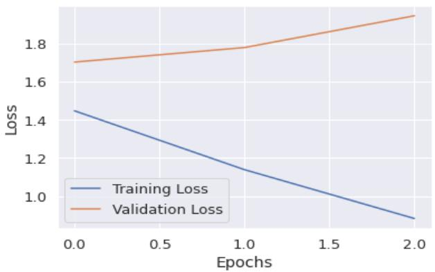  
Figure 4.11: Error Loss of Proposed Model on both Training and Validation Dataset in Experiment-6

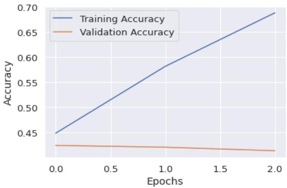  
Figure 4.12: Accuracy of Proposed Model on both Training and Validation Dataset in Experiment-6

In the sixth experiment, as depicted in Figure 4.12, the training accuracy steadily rises across the three epochs, progressing from 45.91% to 69.85%. Conversely, the validation accuracy shows a slight decline, dropping from 43.48% to 42.41% over the same period.

## 4.7 Experiment-7

In the seventh experiment, the model was trained on the augmented MELDN4710 training dataset and evaluated using the MELDT testing dataset. All other experimental settings were kept consistent with those of the third experiment. The training and validation loss values are depicted in Figure 4.13, while the corresponding accuracy metrics are shown in Figure 4.14. This setup facilitates an assessment of the model's performance with the updated training data, enabling an analysis of how data augmentation influences loss and accuracy throughout both training and validation. Examining these results provides valuable insight into the model's generalization capability and effectiveness on the test set.

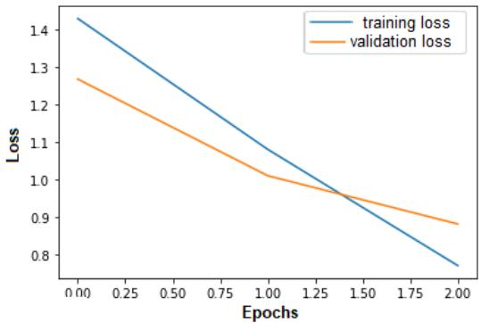  
Figure 4.13: Error Loss of Proposed Model on both Training and Validation Dataset in Experiment-7

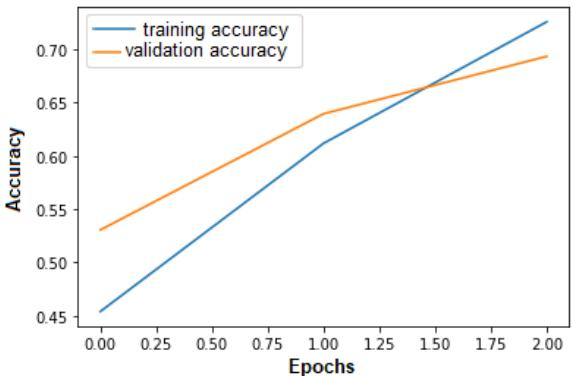  
Figure 4.14: Accuracy of Proposed Model on both Training and Validation Dataset in Experiment-7

The results of the seventh experiment indicate that the model attains its optimal fit. Training accuracy consistently rises from 46.40% to 73.58% across the epochs, accompanied by an improvement in validation accuracy from 54.50% to 70.34%. The normalized confusion matrix corresponding to this experiment is presented in Figure 4.15.

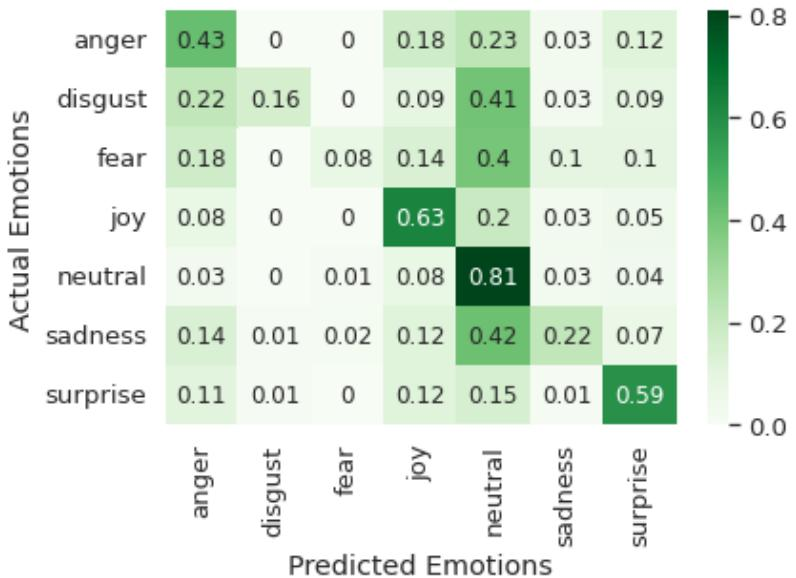  
Figure 4.15: Normalized confusion matrix of Experiment-7

Among all conducted experiments, Experiment Seven (E7) yielded the most favorable outcomes, particularly with respect to overall accuracy and the weighted F1-score, as depicted in Figures 4.14 and 4.15. This performance was achieved using ReLU and SoftMax activation functions, a learning rate of 1e-5, a decay rate of 1e-6, a batch size of 16, categorical cross-entropy as the loss function, and the Adam optimization algorithm. The model trained, evaluated, and tested in E7 is henceforth referred to as "Model7."

Furthermore, we examined how varying the learning rate influences the performance metrics—accuracy and F1-score of Model7. In machine learning and deep learning, the learning rate is a critical hyperparameter that determines the magnitude of updates to model weights during training iterations. It typically falls within the range of 0.0 to 1.0. A higher learning rate can expedite convergence but may result in missing key patterns, while an excessively low learning rate can slow down training and increase the risk of overfitting. Therefore, selecting an optimal learning rate is essential to achieving effective and efficient model training.

This experiment with two epochs shows a positive trend in both training and validation accuracy, suggesting that even with fewer epochs, the model is capable of achieving meaningful results. Comparing these results to the previous experiments can provide insights into whether further increasing epochs or modifying other hyperparameters can enhance performance further

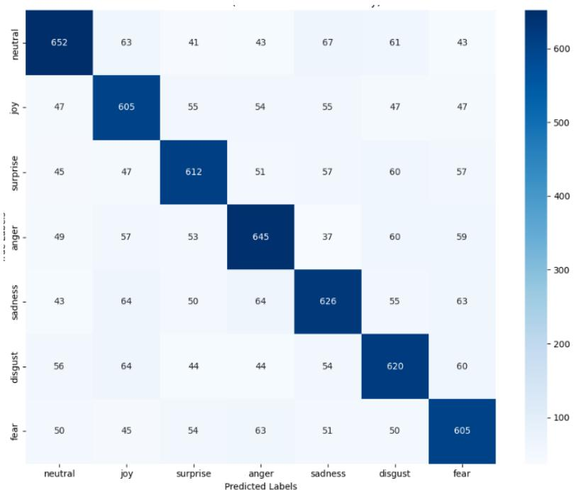  
Figure 4.16: Normalized confusion matrix of proposed model for 2 epochs

Training the proposed model for two epochs yielded the most effective performance across all configurations, achieving both a testing accuracy and a weighted F1-score of 66.20%. This optimal result was obtained using ReLU as the activation function for the hidden layers and SoftMax for the output layer. The model was trained with a learning rate of 1e-5, a decay rate of 1e-6, and a batch size of 32, while employing categorical cross-entropy as the loss function and the Adam optimizer for weight updates. These hyperparameter choices contributed to the model's ability to effectively learn and generalize from the data within a limited number of epochs. Table 4.5 presents the detailed classification report, including precision, recall, and F1-scores for each emotion category, offering valuable insight into the model's performance across different emotional classes. The findings indicate that training the model for only two epochs helped avoid overfitting, resulting in better generalization on unseen data compared to models trained for a greater number of epochs.

Table 4.5: Classification report of the proposed model with 2 epochs

<table><tr><td>Emotion Classes</td><td>Precision (%)</td><td>Recall (%)</td><td>F1-Score (%)</td><td>Support</td></tr><tr><td>Anger</td><td>0.692</td><td>0.672</td><td>0.682</td><td>970</td></tr><tr><td>Disgust</td><td>0.640</td><td>0.665</td><td>0.652</td><td>910</td></tr><tr><td>Fear</td><td>0.673</td><td>0.659</td><td>0.666</td><td>929</td></tr><tr><td>Joy</td><td>0.669</td><td>0.672</td><td>0.670</td><td>960</td></tr><tr><td>Neutral</td><td>0.661</td><td>0.649</td><td>0.655</td><td>965</td></tr><tr><td>Sadness</td><td>0.651</td><td>0.658</td><td>0.654</td><td>942</td></tr><tr><td>Surprise</td><td>0.648</td><td>0.659</td><td>0.653</td><td>918</td></tr><tr><td></td><td></td><td></td><td></td><td></td></tr><tr><td>Accuracy</td><td></td><td></td><td>0.662</td><td>6594</td></tr><tr><td>Macro Average</td><td>0.662</td><td>0.662</td><td>0.662</td><td>6594</td></tr><tr><td>Weighted Average</td><td>0.662</td><td>0.662</td><td>0.662</td><td>6594</td></tr></table>

This section presents a comparative analysis of the proposed model against existing emotion recognition models identified in the literature. The evaluation is based on two primary metrics: overall accuracy and weighted F1-score, as outlined in Table 4.6. The proposed model demonstrates a notable advancement over the current state-of-the-art techniques.

Table 4.6: Accuracy and F1-Score of the proposed model and existing models

<table><tr><td>S.No</td><td>Methods</td><td>Accuracy</td><td>Weighted F1-Score</td></tr><tr><td>1</td><td>RGCN [4]</td><td>-</td><td>55.98%</td></tr><tr><td>2</td><td>DialogueGCN [5]</td><td>59.46%</td><td>58.10%</td></tr><tr><td>3</td><td>DialogueRNN [6]</td><td>59.54%</td><td>57.03%</td></tr><tr><td>4</td><td>DialogueCRN [7]</td><td>60.73%</td><td>58.39%</td></tr><tr><td>5</td><td>CESTa [12]</td><td>-</td><td>58.36%</td></tr><tr><td>6</td><td>AGHMN [14]</td><td>-</td><td>58.10%</td></tr><tr><td>7</td><td>A-DMN [11]</td><td>-</td><td>60.45%</td></tr><tr><td>8</td><td>Multi-Task Learning [15]</td><td>-</td><td>60.69%</td></tr><tr><td>9</td><td>BIERU [19]</td><td>60.90%</td><td>-</td></tr><tr><td>10</td><td>MM-DFN [21]</td><td>62.49%</td><td>59.46%</td></tr><tr><td>11</td><td>Proposed Model</td><td>66.20%</td><td>66.20%</td></tr></table>

## 5. Conclusion

This research presents a computational framework aimed at detecting human emotions within conversational contexts. To address class imbalance in the MELD dataset, text data augmentation techniques are employed, wherein new sentences are synthesized from existing utterances without changing their semantic content. These enriched textual inputs are then converted into vector representations using the RoBERTa language model. The resulting embeddings are fed into a deep neural network for training and validation. The model's effectiveness is measured through a range of evaluation metrics, including accuracy, weighted F1-score, precision, recall, and the confusion matrix. Further assessments are conducted by varying learning rates and batch sizes to analyze their impact on performance. The results indicate that the proposed model significantly surpasses existing methods, attaining a peak accuracy of 66.20% and a weighted F1-score of 66.20%. These improvements highlight the model's enhanced ability to recognize emotions in dialogue. Potential real-world applications of the model span across domains such as mental health diagnostics, monitoring student sentiments in educational settings, human-robot interaction, automated customer service systems, and sentiment analysis in social media and reviews.

## 6. Future Work

Training the model is currently time-intensive; therefore, future efforts will concentrate on optimizing and reducing the overall training duration. Moreover, to further improve model performance, we intend to integrate multimodal data encompassing visual, auditory, and textual inputs into transformer-based architectures. This multimodal fusion is expected to enable more comprehensive emotion recognition by leveraging complementary information from different data sources.

## Conflict of Interest

The authors affirm that no conflicts of interest are linked with this publication. The research was conducted autonomously without financial or non-financial assistance from external entities.

## Author Contribution Statement

The author IS developed the study, formulated the methodology, executed the investigation and data analysis, drafts the original manuscript, and conducted the review and editing of the document. FMA contributed to critical revision or editing the article, final approval of the version to be published, supervision. MSO contributed in critical revision and data interpretation.

## References

[1]. Y. J. Choi, Y. W. Lee, and B. G. Kim (2021). “Residual-Based Graph Convolutional Network for Emotion Recognition in Conversation for Smart Internet of Things,” Big Data, vol. 9, no. 4, pp. 279–288, Aug. 2021, doi: 10.1089/BIG.2020.0274/ASSET/IMAGES/LARGE/BIG.2020.0274\_FIGURE6.JPEG.

[2]. D. Ghosal, N. Majumder, S. Poria, N. Chhaya, and A. Gelbukh (2019). “DialogueGCN: A Graph Convolutional Neural Network for Emotion Recognition in Conversation,” EMNLP-IJCNLP 2019 - 2019 Conf. Empir. Methods Nat. Lang. Process. 9th Int. Jt. Conf. Nat. Lang. Process. Proc. Conf., pp. 154–164, Aug. 2019, doi: 10.48550/arxiv.1908.11540.

[3]. N. M., S. Poria, D. Hazarika, R. Mihalcea, A. Gelbukh, and E. Cambria (2022). “DialogueRNN: An Attentive RNN for Emotion Detection in Conversations,” 2019, Accessed: May 26, 2022. [Online]. Available: www.aaai.org.

[4]. D. Hu, L. Wei, and X. Huai (2021). “DialogueCRN: Contextual Reasoning Networks for Emotion Recognition in Conversations,” ACL-IJCNLP 2021 - 59th Annu. Meet. Assoc. Comput. Linguist. 11th Int. Jt. Conf. Nat. Lang. Process. Proc. Conf., pp. 7042–7052. doi: 10.48550/arxiv.2106.01978.

[5]. P. Zhong, D. Wang, and C. Miao (2019). “DialogueCRN: Contextual Reasoning Networks for Emotion Recognition in Conversations,” EMNLP-IJCNLP 2019 - 2019 Conf. Empir. Methods Nat. Lang. Process. 9th Int. Jt. Conf. Nat. Lang. Process. Proc. Conf., pp. 165–176, Sep. 2019, doi: 10.48550/arxiv.1909.10681.

[6]. S. M. Mohammad (2018). “Obtaining Reliable Human Ratings of Valence, Arousal, and Dominance for 20,000 English Words,” ACL 2018 - 56th Annu. Meet. Assoc. Comput. Linguist. Proc. Conf. (Long Pap., vol. 1, pp. 174–184. doi: 10.18653/V1/P18-1017.

[7]. R. Speer, J. Chin, and C. Havasi (2022). “Concept Net 5.5: An Open Multilingual Graph of General Knowledge,” Thirty-first AAAI Conf. Artif. Intell., no. Singh 2002, pp. 4444–4451, 2017, [Online]. Available: http://arxiv.org/abs/1612.03975.

[8]. S. Xing, S. Mai, and H. Hu (2020). “Adapted Dynamic Memory Network for Emotion Recognition in Conversation,” IEEE Trans. Affect. Comput. doi: 10.1109/TAFFC.2020.3005660.

[9]. Y. Wang, J. Zhang, J. Ma, S. Wang, and J. Xiao (2020). “Contextualized emotion recognition in conversation as sequence tagging,” SIGDIAL 2020 - 21st Annu. Meet. Spec. Interes. Gr. Discourse Dialogue, Proc. Conf., no. July, pp. 186–195.

[10]. S. L. Yeh, Y. S. Lin, and C. C. Lee (2020). “A Dialogical Emotion Decoder for Speech Motion Recognition in Spoken Dialog,” ICASSP, IEEE Int. Conf. Acoust. Speech Signal Process. - Proc., vol. 2020-May, pp. 6479–6483, May 2020, doi: 10.1109/ICASSP40776.2020.9053561.

[11]. W. Jiao, M. R. Lyu, and I. King (2020). “Real-time emotion recognition via attention gated hierarchical memory network,” AAAI 2020 - 34th AAAI Conf. Artif. Intell., pp. 8002–8009. doi: 10.1609/aaai.v34i05.6309.

[12]. J. Li, M. Zhang, D. Ji, and Y. Liu (2020). “Multi-Task Learning with Auxiliary Speaker Identification for Conversational Emotion Recognition,” arXiv Prepr. arXiv2003.01478. [Online]. Available: http://arxiv.org/abs/2003.01478.

[13]. D. Zhang, L. Wu, C. Sun, S. Li, Q. Zhu, and G. Zhou (2019). “Modeling both Context- and Speaker-Sensitive Dependence for Emotion Detection in Multi-speaker Conversations,” IJCAI, pp. 5415–5421.

[14]. D. Sheng, D. Wang, Y. Shen, H. Zheng, and H. Liu (2020). “Summarize before Aggregate: A Global-to-local Heterogeneous Graph Inference Network for Conversational Emotion Recognition,” Proc. 28th Int. Conf. Comput. Linguist., pp. 4153–4163, Jan. 2020, doi: 10.18653/V1/2020.COLING-MAIN.367.

[15]. X. Lu, Y. Zhao, Y. Wu, Y. Tian, H. Chen, and B. Qin (2020). “An Iterative Emotion Interaction Network for Emotion Recognition in Conversations,” Proc. 28th Int. Conf. Comput. Linguist., pp. 4078–4088. doi: 10.18653/V1/2020.COLING-MAIN.360.

[16]. W. Li, W. Shao, S. Ji, and E. Cambria (2022). “BiERU: Bidirectional emotional recurrent unit for conversational sentiment analysis,” Neurocomputing, vol. 467, pp. 73–82, doi: 10.1016/J.NEUCOM.2021.09.057.

[17]. T. Ishiwatari, Y. Yasuda, T. Miyazaki, and J. Goto (2020). “Relation-aware Graph Attention Networks with Relational Position Encodings for Emotion Recognition in Conversations,” EMNLP 2020 - 2020 Conf. Empir. Methods Nat. Lang. Process. Proc. Conf., pp. 7360–7370. doi: 10.18653/V1/2020.EMNLP-MAIN.597.

[18]. D. Hu, X. Hou, L. Wei, L. Jiang, and Y. Mo (2022). “MM-DFN: Multimodal Dynamic Fusion Network for Emotion Recognition in Conversations,” ICASSP 2022 - 2022 IEEE Int. Conf. Acoust. Speech Signal Process., pp. 7037–7041. doi: 10.1109/ICASSP43922.2022.9747397.
